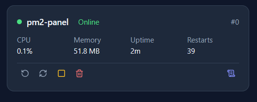

# PM2 Server Dashboard

A modern web-based dashboard for managing PM2 processes, GitHub repositories, and deployments with SSH key integration.


## Features

- **Process Management**: Start, stop, restart, reload, and delete PM2 processes
- **GitHub Integration**: Clone and deploy repositories via SSH
- **Real-time Monitoring**: View CPU, memory, uptime, and restart count for each process
- **SSH Key Management**: Generate and manage SSH keys for GitHub authentication
- **Multi-language Support**: English and Turkish (Türkçe) language options
- **Dark/Light Theme**: Customizable theme for comfortable viewing
- **Password Protection**: Optional password authentication for access control
- **Cross-platform**: Works on Windows, Linux (mainly tested on Ubuntu)


## Installation

### Prerequisites

- Node.js (v14 or higher)
- PM2 installed globally: `npm install -g pm2`
- Git


### Linux (Ubuntu) Installation

1. Install Node.js and PM2:
```bash
curl -fsSL https://deb.nodesource.com/setup_18.x | sudo -E bash -
sudo apt-get install -y nodejs
sudo npm install -g pm2
```

2. Clone the repository:
```bash
git clone https://github.com/CanAydinCs/pm2-server
cd pm2-server
```

3. Install dependencies:
```bash
npm install
cd backend && npm install && cd ..
cd frontend && npm install && cd ..
```

4. Build the frontend:
```bash
cd frontend
npm run build
cd ..
```

5. Start with PM2:
```bash
pm2 start ecosystem.config.js
pm2 save
pm2 startup
```

## SSH Key Setup

### Why SSH Keys?

SSH keys provide a secure way to authenticate with GitHub without entering your password for every operation.

### Setting Up SSH Keys

#### Option 1: Using the Dashboard

1. Go to **Settings** → **GitHub SSH Key**
2. Click **Generate SSH Key** button
3. A modal will appear with your public key
4. Click **Copy Key** to copy the public key
5. Click **GitHub'a Git** to open GitHub's SSH keys page
6. Paste the key and click "Add SSH key"
7. Return to the dashboard and click **Test Connection**


#### Option 2: Manual Setup

1. Generate SSH key on your server:
```bash
ssh-keygen -t ed25519 -C "your_email@example.com"
# Press Enter to accept default location
# Press Enter for no passphrase (or add one for extra security)
```

2. Copy the public key:
```bash
cat ~/.ssh/id_ed25519.pub
```

3. Add to GitHub:
   - Go to GitHub → Settings → SSH and GPG keys → New SSH key
   - Paste the public key
   - Add a title (e.g., "PM2 Server")
   - Click "Add SSH key"

4. Test the connection:
```bash
ssh -T git@github.com
```

You should see: `Hi <username>! You've successfully authenticated...`

### SSH Key Permissions (Linux/Ubuntu)

On Linux systems, ensure correct permissions:
```bash
chmod 700 ~/.ssh
chmod 600 ~/.ssh/id_ed25519
chmod 644 ~/.ssh/id_ed25519.pub
```

## Usage

### Adding a Project

1. Navigate to **Projects** page
2. Click **Add Project** button


3. Fill in the required fields:
   - **Repo URL**: Your GitHub repository URL (SSH format: `git@github.com:user/repo.git`)
   - **Folder Name**: Name for the project folder (optional, defaults to repo name)

4. Click **Clone** to clone the repository

### Managing Processes

Once a project is cloned and has an ecosystem file, you'll see process cards on the Dashboard:

- **Start**: Start a stopped process
- **Stop**: Stop a running process
- **Restart**: Restart a process
- **Reload**: Gracefully reload a process (zero-downtime restart)
- **Delete**: Remove the process from PM2



### Viewing Logs

1. Go to **Logs** page
2. Select a process from the dropdown
3. View real-time logs with timestamps


### Deploying/Updating

To update a repository:

1. Go to **Projects** page
2. Click the **Deploy** button next to a project
3. The system will pull the latest changes from GitHub

## Configuration

### Settings

Access settings via the **Settings** page:

- **Repo Directory**: Default directory for cloning repositories
- **Theme**: Switch between dark and light mode
- **Language**: Choose between English and Turkish


### Password Protection

Add or change password protection:

1. Go to **Settings** → **Password**
2. Enter current password (if set) and new password
3. Click **Change Password**

To remove password protection:

1. Enter current password
2. Click **Remove Password**

### Ecosystem Configuration

Projects can use PM2 ecosystem files for advanced configuration:

Create an `ecosystem.config.js` file in your repository:

```javascript
module.exports = {
  apps: [{
    name: 'my-app',
    script: 'npm',
    args: 'start',
    env: {
      NODE_ENV: 'production',
      PORT: 3000
    }
  }]
};
```

## API Reference

### Authentication

All API endpoints require session authentication (cookies).

### Settings Endpoints

#### GET `/pm2/master/api/settings`
Get current configuration settings

#### PATCH `/pm2/master/api/settings`
Update configuration settings

**Body:**
```json
{
  "repoDir": "/path/to/repos",
  "theme": "dark",
  "language": "en"
}
```

### SSH Key Endpoints

#### POST `/pm2/master/api/settings/ssh/generate-key`
Generate a new SSH key pair

#### GET `/pm2/master/api/settings/ssh/key-exists`
Check if SSH key exists

**Response:**
```json
{
  "exists": true
}
```

#### GET `/pm2/master/api/settings/ssh/public-key`
Get the public SSH key

**Response:**
```json
{
  "publicKey": "ssh-ed25519 AAAA..."
}
```

#### POST `/pm2/master/api/settings/ssh/recheck`
Test SSH connection to GitHub

**Response:**
```json
{
  "connected": true,
  "username": "CanAydinCs",
  "lastChecked": "2024-03-04T10:30:00.000Z"
}
```

### Process Endpoints

#### GET `/pm2/master/api/processes`
Get list of all PM2 processes

#### POST `/pm2/master/api/processes/:name/start`
Start a process

#### POST `/pm2/master/api/processes/:name/stop`
Stop a process

#### POST `/pm2/master/api/processes/:name/restart`
Restart a process

#### POST `/pm2/master/api/processes/:name/reload`
Reload a process (zero-downtime)

#### DELETE `/pm2/master/api/processes/:name`
Delete a process from PM2

### Repository Endpoints

#### GET `/pm2/master/api/repos`
Get list of cloned repositories

#### POST `/pm2/master/api/repos/clone`
Clone a GitHub repository

**Body:**
```json
{
  "repoUrl": "git@github.com:user/repo.git",
  "folderName": "my-project"
}
```

#### POST `/pm2/master/api/repos/:name/deploy`
Deploy/update a repository (pull latest changes)

#### DELETE `/pm2/master/api/repos/:name`
Delete a cloned repository

### Logs Endpoints

#### GET `/pm2/master/api/logs/:name`
Get logs for a specific process


### Step-by-Step Deployment


1. **Install dependencies**:
```bash
sudo apt update
sudo apt install -y git nodejs npm
npm install -g pm2
```

2. **Clone and setup**:
```bash
git clone <your-repo-url>
cd pm2-server
npm install
cd backend && npm install && cd ..
cd frontend && npm install && npm run build && cd ..
```

3. **Start with PM2**:
```bash
pm2 start ecosystem.config.js
pm2 save
pm2 startup
```


### Building for Production

```bash
cd frontend
npm run build
```

The built files will be in `frontend/dist/`.

## Contributing

Contributions are welcome! Please follow these steps:

1. Fork the repository
2. Create a feature branch: `git checkout -b feature/my-feature`
3. Commit your changes: `git commit -am 'Add new feature'`
4. Push to the branch: `git push origin feature/my-feature`
5. Submit a pull request

## License

This project is licensed under the MIT License.

## Support

For issues, questions, or contributions:

- GitHub Issues: [Create an issue on GitHub](https://github.com/CanAydinCs/pm2-server/issues)
- Email: your.email@example.com

## Changelog

### Version 1.0.0
- Initial release

---

**Made with ❤️ for PM2 users**