# UI Documentation

Complete user interface guide for PM2 Server Dashboard.

## Table of Contents

- [Overview](#overview)
- [Login Page](#login-page)
- [Dashboard](#dashboard)
- [Process Management](#process-management)
- [Projects](#projects)
- [Settings](#settings)
- [Logs](#logs)
- [Responsive Design](#responsive-design)
- [Themes & Languages](#themes--languages)

---

## Overview

The PM2 Server Dashboard provides a modern, intuitive interface for managing PM2 processes, GitHub repositories, and deployments. The dashboard is fully responsive and works on desktop and mobile devices.

### Navigation

The main navigation is accessible from the header and includes:

- **Dashboard**: View and manage running processes
- **Projects**: Clone, deploy, and manage repositories
- **Settings**: Configure SSH keys, passwords, and preferences
- **Theme Toggle**: Switch between dark and light mode
- **Language Selector**: Choose between English and Turkish

---

## Login Page

The login page is the entry point to the dashboard.

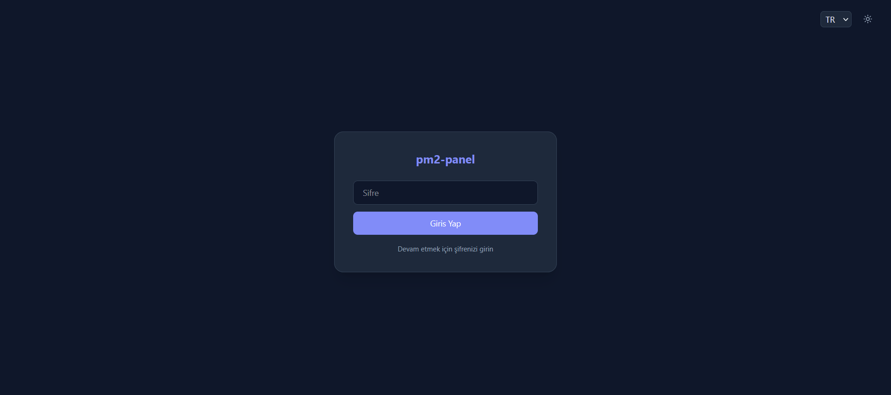

### Password Behavior

**Important**: The login screen is always visible, but authentication behavior changes based on password configuration:

- **No Password Set**: Any password will work for login
- **Password Set**: Only the exact configured password will grant access

### Login Flow

1. User enters password in the password field
2. Click "Login" button
3. On successful authentication, user is redirected to Dashboard
4. Session is maintained via cookie

### Security Features

- Session-based authentication
- Automatic redirect to login if session expires
- Password can be set/changed/removed from Settings

---

## Dashboard

The Dashboard is the main page showing all PM2 processes with real-time monitoring.

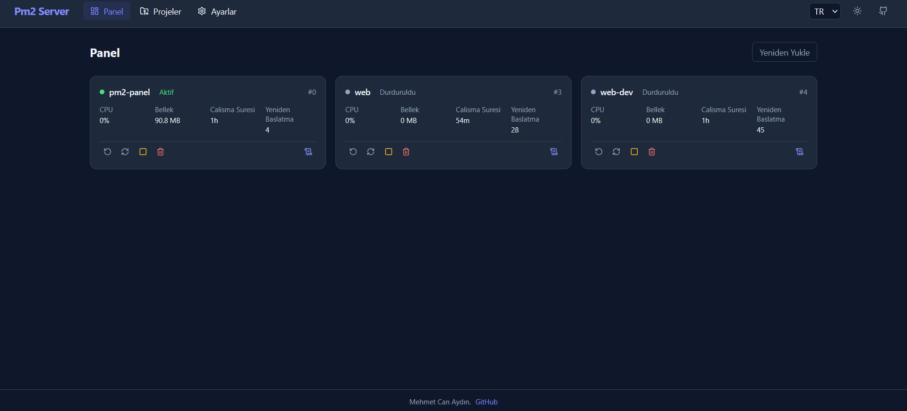

### Real-Time Monitoring

The Dashboard displays live statistics for each process:

- **CPU Usage**: Current CPU consumption percentage
- **Memory Usage**: Current memory consumption in MB
- **Uptime**: Time since process started
- **Restart Count**: Number of times the process has restarted
- **Status**: Current process state (online, stopped, etc.)

### Process Cards

Each process is displayed in a card with the following elements:

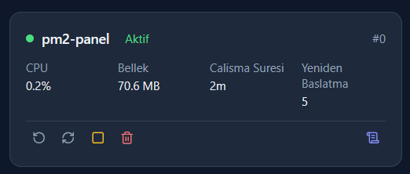

**Process Name**: Displayed at the top of the card

**Status Indicator**: Color-coded badge showing current status:
- 🟢 Green: Online/Running
- 🔴 Red: Stopped
- 🟡 Yellow: Errored/Restarting

**Metrics**: Real-time statistics
- CPU: Updated every few seconds
- Memory: Updated every few seconds
- Uptime: Human-readable format (e.g., "2d 5h 30m")
- Restarts: Integer count

**Control Buttons**:

1. **Start** : Start a stopped process
2. **Stop** : Stop a running process
3. **Restart** : Restart the process
4. **Reload** : Gracefully reload (zero-downtime restart)
5. **Delete** : Remove process from PM2

### Refresh Rate

Process statistics are updated automatically every 5 seconds. No manual refresh is required.

### Empty State

When no processes are running, the Dashboard displays a message indicating that no processes are available and suggesting to add projects from the Projects page.

---

## Process Management

### Starting a Process

1. Navigate to Dashboard
2. Find the stopped process card
3. Click the **Start**  button
4. Process will start and status will change to "online"

### Stopping a Process

1. Navigate to Dashboard
2. Find the running process card
3. Click the **Stop** button
4. Process will stop and status will change to "stopped"

### Restarting a Process

1. Navigate to Dashboard
2. Find the process card
3. Click the **Restart** button
4. Process will restart immediately
5. Status will temporarily change then return to "online"

### Reloading a Process

1. Navigate to Dashboard
2. Find the process card
3. Click the **Reload**  button
4. Process reloads gracefully with zero downtime
5. Best for production environments to avoid service interruption

### Deleting a Process

1. Navigate to Dashboard
2. Find the process card
3. Click the **Delete**  button
4. Confirm the deletion (if prompted)
5. Process is removed from PM2 and no longer appears on Dashboard

**Note**: Deleting a process does NOT delete the repository files. Use the Projects page to delete repositories.

---

## Projects

The Projects page allows you to clone GitHub repositories and deploy applications.

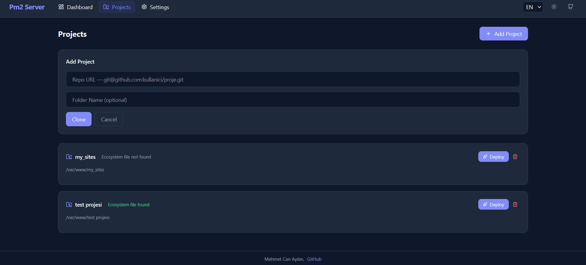

### Adding a New Project

1. Navigate to the **Projects** page
2. Click the **Add Project** button
3. A modal will appear with the following fields:

#### Repository URL

Enter the GitHub repository URL in SSH format:
```
git@github.com:username/repo.git
```

**Note**: HTTPS URLs are not supported. You must use SSH format and have an SSH key configured.

#### Folder Name (Optional)

Specify a custom folder name for the cloned repository. If left blank, it defaults to the repository name.

Example:
- Repository: `git@github.com:user/my-awesome-app.git`
- Default folder: `my-awesome-app`
- Custom folder: `awesome`

4. Click the **Clone** button
5. The system will clone the repository
6. Progress is shown in real-time via WebSocket
7. On success, the project appears in the projects list

### Project List

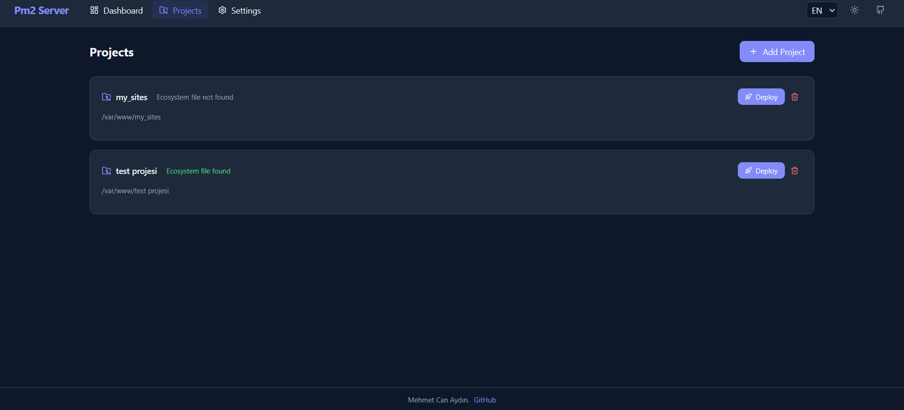

Each project in the list shows:

- **Project Name**: Folder name of the repository
- **Path**: Full path to the repository
- **Ecosystem Status**: Indicates if an ecosystem file exists
- **Actions**: Buttons for deployment and deletion

### Deploying/Updating a Project

1. Navigate to the **Projects** page
2. Find the project you want to update
3. Click the **Deploy** button
4. The system will:
   - Pull latest changes from GitHub
   - Show real-time progress via WebSocket
   - Notify when deployment is complete

**Deployment Process**:
1. Runs `git pull` in the repository directory
2. Updates the repository to the latest commit
3. Optionally restarts PM2 processes (if configured)

### Deleting a Project

1. Navigate to the **Projects** page
2. Find the project you want to delete
3. Click the **Delete** button
4. Confirm the deletion
5. The repository folder is deleted from the filesystem

**Warning**: Deleting a project permanently removes all files from the server. This cannot be undone.

### Ecosystem Files

Projects can use PM2 ecosystem configuration files for advanced setup:

Supported ecosystem file names:
- `ecosystem.config.js`
- `ecosystem.config.cjs`
- `ecosystem.json`

**Example ecosystem.config.js**:
```javascript
module.exports = {
  apps: [{
    name: 'my-app',
    script: 'npm',
    args: 'start',
    env: {
      NODE_ENV: 'production',
      PORT: 3000
    }
  }]
};
```

If a project has an ecosystem file, the dashboard automatically detects and uses it.

---

## Settings

The Settings page allows you to configure the dashboard, manage SSH keys, and control access.

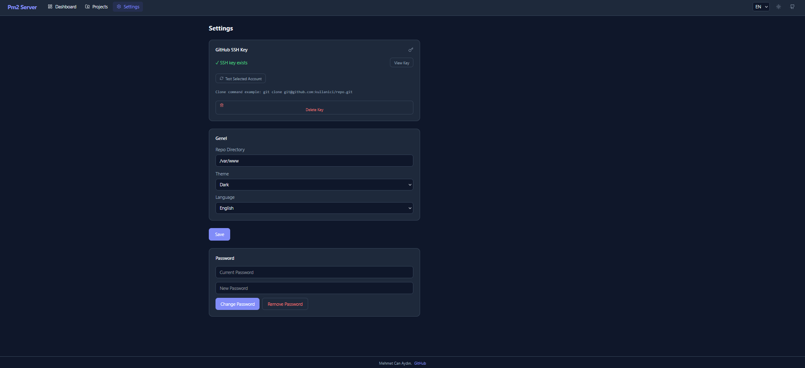

### SSH Key Management

#### Generating an SSH Key

1. Navigate to **Settings** → **GitHub SSH Key** section
2. If no key exists, click **Generate SSH Key** button
3. A modal will appear with your public key
4. Click **Copy Key** to copy the public key
5. Click **Go to GitHub** to open GitHub's SSH keys page
6. Paste the key and click "Add SSH key"
7. Return to dashboard and click **Test Connection**

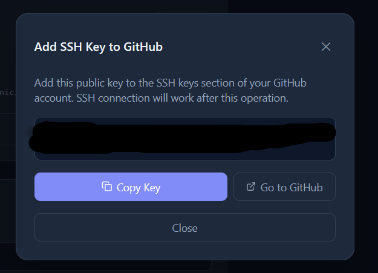 

#### Viewing the Public Key

1. Navigate to **Settings** → **GitHub SSH Key** section
2. Click **View Key** button
3. The modal shows your public key for copying

#### Testing SSH Connection

1. Navigate to **Settings** → **GitHub SSH Key** section
2. Click the **Test Connection** button
3. The system will test SSH connection to GitHub
4. Result appears below the button:

**Success**:
```
✓ Connected as GitHubUsername
```

**Failure**:
```
✗ Connection failed: Permission denied
```

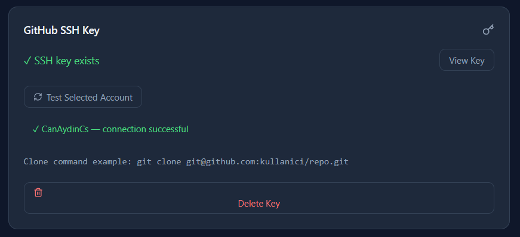
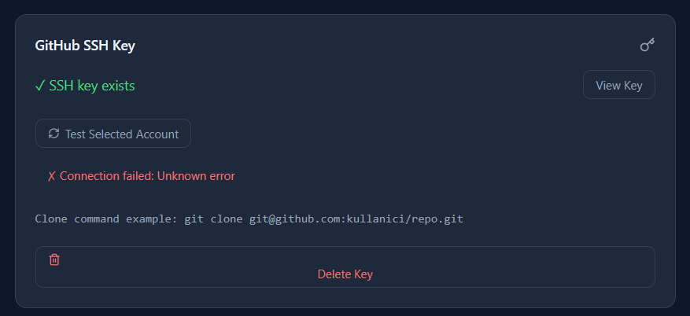

#### Deleting an SSH Key

1. Navigate to **Settings** → **GitHub SSH Key** section
2. Click the **Delete SSH Key** button
3. A confirmation modal appears
4. Check **Delete from system** if you want to permanently delete the SSH key file
5. Uncheck to only remove from dashboard configuration
6. Click **Delete** to confirm

**Delete Options**:
- **Remove from config only**: Key file remains in `~/.ssh/id_ed25519`
- **Delete from system**: Key file is permanently removed from server

### General Settings

#### Repository Directory

Set the default directory for cloning repositories.

**Default**: `/path/to/repos` (Linux) or `C:\repos` (Windows)

To change:
1. Navigate to **Settings** → **General** section
2. Enter new path in **Repo Directory** field
3. Click **Save** button

#### Theme

Switch between dark and light themes.

1. Navigate to **Settings** → **General** section
2. Select theme from dropdown:
   - Dark
   - Light
3. Theme applies immediately and persists across sessions

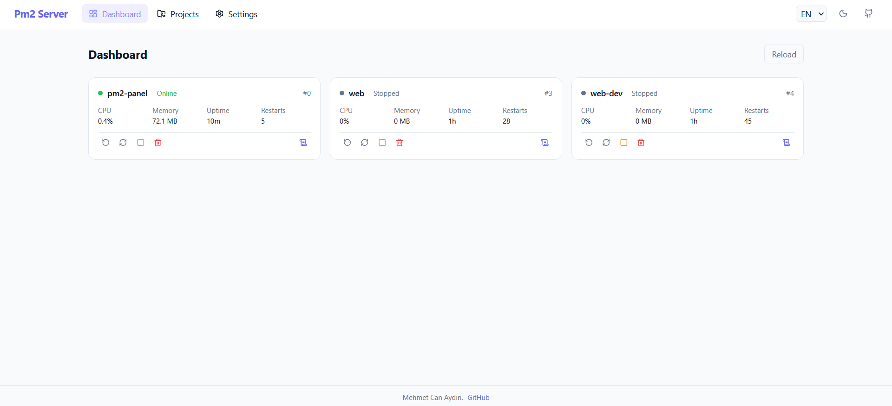 

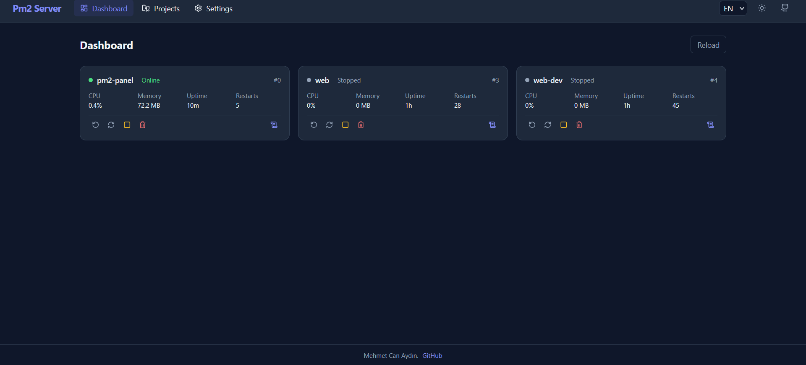 

#### Language

Choose between English and Turkish.

1. Navigate to **Settings** → **General** section
2. Select language from dropdown:
   - English
   - Türkçe
3. Language applies immediately and persists across sessions

### Password Management

#### Setting a Password

1. Navigate to **Settings** → **Password** section
2. Enter **New Password**
3. (Optional) If password already exists, enter **Current Password**
4. Click **Change Password** button

#### Changing a Password

1. Navigate to **Settings** → **Password** section
2. Enter **Current Password**
3. Enter **New Password**
4. Click **Change Password** button

#### Removing Password

1. Navigate to **Settings** → **Password** section
2. Enter **Current Password**
3. Click **Remove Password** button
4. Confirm the removal

**Note**: After removing the password, the login screen will still appear, but any password will work for login.

**Update Process**:

1. Navigate to **Settings** → **Update Server** section
2. Click **Update & Restart** button
3. The system will:
   - Run `git pull` to fetch latest changes
   - Run `npm install` in frontend directory
   - Run `npm run build` in frontend directory
   - Restart the PM2 process
4. Progress is shown in real-time logs below the button
5. When complete, a message appears: "Server is restarting. Please refresh the page in a few moments."
6. Refresh your browser to see the updated version

**Update Logs**:
- Logs show each step of the update process
- Errors are highlighted in red
- Successful steps are shown in muted text

**Important**:
- The server will restart during the update
- You may experience a brief connection loss
- Refresh the page after the restart completes
- The update uses the local Git repository, so it works even if the GitHub URL changes

---

## Logs

The Logs page allows you to view real-time and historical logs for any PM2 process.

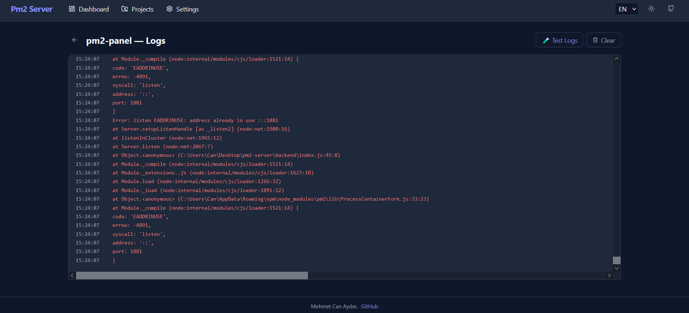

### Viewing Logs

1. Navigate to the **Logs** page
2. Select a process from the dropdown menu
3. Logs are displayed with timestamps
4. New logs appear automatically (real-time)

### Log Types

Logs are categorized by type:

- **Out (stdout)**: Standard output from the process
- **Err (stderr)**: Error output from the process
- **All**: Both stdout and stderr combined

### Log Display

Each log entry includes:

- **Timestamp**: Date and time of the log entry
- **Type**: Log type (out/err)
- **Message**: The actual log content

**Color Coding**:
- Standard output: Default text color
- Error output: Red/burgundy color

### Process Selection

Use the dropdown at the top of the page to select which process to view logs for. The dropdown lists all PM2 processes by name.

### Real-Time Updates

New logs are streamed via WebSocket and appear automatically. No manual refresh is needed.

---

## Responsive Design

The dashboard is fully responsive and works on:

- **Desktop**: Full-width layout with sidebar navigation
- **Tablet**: Adjusted layout with optimized spacing
- **Mobile**: Compact layout with mobile menu

### Mobile Navigation

On mobile devices (screen width < 768px):

- The header navigation collapses into a hamburger menu
- Click the menu icon (☰) to open the mobile sidebar
- The sidebar slides in from the right
- Tap outside the sidebar or click the X to close it
- All navigation links and settings are accessible from the sidebar

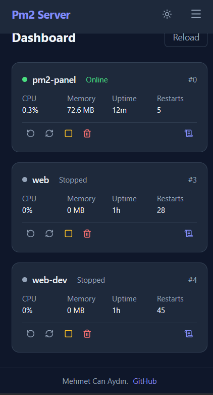 

### Mobile Features

- Touch-friendly buttons and controls
- Optimized spacing for touch targets
- Scrollable tables and lists
- Responsive images and cards

---

## Themes & Languages

### Theme System

The dashboard supports two themes:

#### Dark Theme (Default)

- Dark background with light text
- Reduced eye strain
- Suitable for low-light environments
- Professional, modern appearance

#### Light Theme

- Light background with dark text
- Better visibility in bright environments
- Traditional interface look
- High contrast for readability

Theme selection is saved to local storage and persists across browser sessions.

### Language Support

The dashboard currently supports two languages:

#### English

- Full UI translations
- Default language
- Used throughout this documentation

#### Türkçe (Turkish)

- Complete Turkish translations
- Same feature set as English
- Selected via Settings or language dropdown

Language selection is saved to local storage and persists across browser sessions.

### Changing Theme/Language

You can change theme and language from:

1. **Settings Page**: Persistent changes saved to server
2. **Header**: Quick theme toggle and language selector
3. **Initial Setup**: First-time configuration

---

## User Interface Elements

### Buttons

- **Primary Buttons**: Accent color, used for main actions
- **Secondary Buttons**: Border style, used for secondary actions
- **Danger Buttons**: Red/burgundy, used for destructive actions
- **Icon Buttons**: Compact buttons with icons, used for space-saving

### Modals

Modals are used for:

- SSH key display
- Confirmation dialogs
- Project cloning
- Settings forms

**Modal Features**:
- Click outside to close
- Press Escape to close
- Close button (X) in header
- Overlay background

### Toast Notifications

Notifications appear for:

- Success actions
- Error messages
- Warning alerts
- Information updates

**Notification Behavior**:
- Auto-dismiss after a few seconds
- Color-coded by type (success/error/warning)
- Stackable for multiple notifications

### Loading States

Loading indicators appear during:

- API requests
- Long-running operations
- Data fetching

**Loading Indicators**:
- Spinners on buttons
- Loading text in empty states
- Progress bars for operations

---

## Accessibility

The dashboard follows accessibility best practices:

- Semantic HTML structure
- Keyboard navigation support
- ARIA labels for screen readers
- High contrast ratios
- Focus indicators

---

### Efficient Workflow

1. **Set up SSH key once**: Use the same SSH key for all repositories
2. **Organize with folders**: Use meaningful folder names for projects
3. **Monitor regularly**: Check Dashboard for process health
4. **Use logs wisely**: Filter logs by type when troubleshooting
5. **Keep updated**: Use Self-Update feature regularly

### Best Practices

- Use meaningful repository and project names
- Set up ecosystem files for consistent deployments
- Use "Reload" instead of "Restart" for zero-downtime updates
- Keep SSH key secure and backed up
- Regularly check process logs for issues

---

## Troubleshooting

### Login Issues

**Problem**: Cannot log in
- **Solution**: Try any password if no password is set
- **Solution**: Check if password was recently changed
- **Solution**: Clear browser cookies and try again

### SSH Connection Issues

**Problem**: SSH connection test fails
- **Solution**: Ensure public key is added to GitHub
- **Solution**: Check SSH key permissions (Linux: `chmod 600 ~/.ssh/id_ed25519`)
- **Solution**: Verify SSH key format (must be ed25519)

### Process Not Starting

**Problem**: Process won't start
- **Solution**: Check process logs for errors
- **Solution**: Verify ecosystem file configuration
- **Solution**: Ensure dependencies are installed

### Deployment Fails

**Problem**: Repository deployment fails
- **Solution**: Check if SSH key is configured
- **Solution**: Verify repository URL format (SSH only)
- **Solution**: Check repository permissions

### Update Fails

**Problem**: Self-update fails
- **Solution**: Check if directory is a Git repository
- **Solution**: Ensure no uncommitted changes
- **Solution**: Check internet connection

---

[← Back to Main README](../README.md) | [API Documentation](API.md)